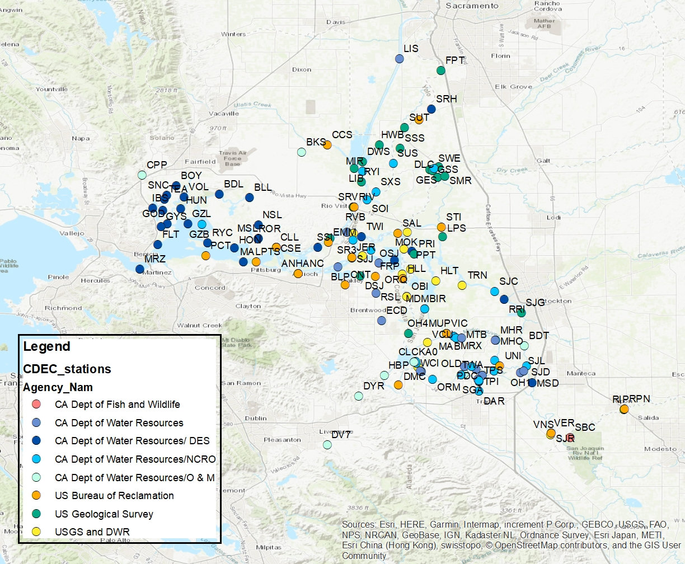

```{r setup, include=FALSE}
knitr::opts_chunk$set(echo = TRUE)
library(lubridate)
library(tidyverse)
library(vegan)
library(sf)
library(RColorBrewer)
library(gridExtra)
library(scales)
library(ggmap)
# tempFilt <- readRDS("Data/tempFilt.rds") 
# tempToUse <- readRDS("Data/temp10years_20200922.rds")
tempAn0 <- readRDS("Data/tempAnnual.rds")
tempMon <- readRDS("Data/tempMonthly.rds")
# tempDaily <- readRDS("Data/tempDaily.rds")
# tempHeat <- readRDS("Data/heatstressDaily.rds")

```


```{r}


tempAn0 <- filter(tempAn0, WY > 2008 & WY < 2020) 

nYear <- tempAn0 %>%
  group_by(Station, WY) %>%
  summarize(n()) %>%
  ungroup() %>%
  group_by(Station) %>%
  summarize(nYear = n())

tempAn <- left_join(tempAn0, nYear) %>%
  filter(nYear == 11)
```

## Use monthly means, mins, and maxes

I haven't sat down to compare the monthly mins, means, and maxes with the daily means, but a quick look seems like they are pretty similar

```{r warning=FALSE, message=FALSE, fig.width=12}
tempAn2_all <- tempAn %>%
  group_by(Station, WY) %>%
  summarize(max = mean(maxTemp),
         min = min(minTemp),
         mean = mean(meanTemp),
         range = mean(rangeTemp))

#put it into wide format for the cluster analysis
tempAnwide = pivot_wider(tempAn, id_cols = c(Station), 
                       names_from = WY, values_from = meanTemp)
tempAnwide2 = pivot_wider(tempAn, id_cols = c(Station), 
                         names_from = WY, values_from = minTemp)
tempAnwide3 = pivot_wider(tempAn, id_cols = c(Station), 
                         names_from = WY, values_from = maxTemp)
tempAnwide4 = pivot_wider(tempAn, id_cols = c(Station), 
                         names_from = WY, values_from = rangeTemp)

tempAnwide5 = cbind(tempAnwide[-1], tempAnwide2[,-1], tempAnwide3[,-1], tempAnwide4[,-1])

row.names(tempAnwide) = tempAnwide$Station

#calculate distance and cluster
tempdist = dist(tempAnwide[-1], "euclidean")
tempfit = hclust(tempdist, method = "ward.D")
plot(tempfit, main = "Clusters based on annual mean, min, max, range", cex = 0.6)

```

pheatmap-dendrogram and heat map

```{r}
library(pheatmap)
library(viridis)
tempAnwide1 <- tempAnwide[-1]
tempAnwide_s <- scale(tempAnwide1)
row.names(tempAnwide_s) <- tempAnwide$Station
pheatmap(tempAnwide_s, cluster_cols = F, main = "Station Clusters")

tempAnwide1 <- as.data.frame(tempAnwide1)
row.names(tempAnwide1) <- tempAnwide$Station
# Row annotation: Region (as assigned by Rosie previously)
row_annot <- tempAn %>%
  select(1:2) %>%
  unique()%>%
  as.data.frame()
rownames(row_annot) <- row_annot$Station 
row_annot <- row_annot[1]

# Column annotation: WY Type
col_annot <- tempAn %>%
  select(c(WY, WYType2_Sac)) %>%
  unique() %>%
  as.data.frame() 
rownames(col_annot) <- col_annot$WY
col_annot <- col_annot[2]

# Colors for annotations
newCols <- colorRampPalette(grDevices::rainbow(length(unique(row_annot$Region))))
mycolors <- newCols(length(unique(row_annot$Region)))
names(mycolors) <- unique(row_annot$Region)
mycolors <- list(category = mycolors)

# Heat map
# Order years
tempAnwide_yearorder <- tempAnwide1 %>%
  select(c("2009", "2010", "2011", "2012", "2013", "2014", "2015", "2016", "2017", "2018"))

pheatmap(tempAnwide_yearorder, scale = "column", annotation_row = row_annot, cluster_cols = F, main = "Compare Stations")

pheatmap(tempAnwide_yearorder, scale = "row", annotation_row = row_annot,  annotation_col = col_annot,
         cluster_cols = F, main = "Compare Years")


# Clustered years
pheatmap(tempAnwide1, scale = "row", annotation_col = col_annot, 
         main = "Compare years")


```


I thought I'd look at a quick NMDS too, just for fun

```{r warning=FALSE, message=FALSE, echo=FALSE}
tempNMDS = metaMDS(tempdist, trymax = 200)
plot(tempNMDS, type = "n")
text(tempNMDS, "sites", labels = tempAnwide5$Station)

```



## Cutting down the trees

Now I can cut my trees into groups to see how they map out.

```{r}
cutday = as.data.frame(cutree(tempfit, k = c(2,4,6,12)))
cutday$Station = row.names(cutday)
```


## Plot

I trimmed the tree into different numbers of groups, so see what we get when we try to divide it into 4,6, or 12 regions. Personally, I like the 6 group version best.

```{r}
#read in shapefile of the delta
delta = read_sf("DeltaShapefile/hydro_delta_marsh.shp")


#read in shapefile of EDSM regions
edsm = read_sf("EDSM_Subregions/EDSM_Subregions_03302020.shp")
#reference system is UTMs
st_crs(edsm) = 32610
edsm = st_transform(edsm, 4326)


#add lat/longs for the stations
stas = read.csv("StationLatLongs.csv")

cutday = merge(stas, cutday, all.x =T)
names(cutday) = c("Station", "Latitude", "Longitude", "grps2", "grps4", "grps6", "grps12")

#turn it into a spatial object
stashap = st_as_sf(cutday,
                coords = c("Longitude", "Latitude"),
                crs = 4326)

# save(stashap, file ="stations.rdata")

#Make plots of the stations divided into four groups, six groups
#or twelve groups based on teh cluster analysis. 
gp4 = ggplot() +
  geom_sf(data = delta, alpha = 0.5)+
  geom_sf(data = stashap, mapping =aes(color = as.factor(grps4)))+
  theme_bw() + guides(color = FALSE) + 
  coord_sf(xlim = c(-122.2, -121), ylim = c(37.6, 38.8))+
  ggtitle("4 groups")

library(RColorBrewer)
mypal = c(brewer.pal(9, "Blues"), brewer.pal(9, "BuGn"), 
          brewer.pal(9, "Greys"), brewer.pal(9, "PuBu"), brewer.pal(9, "YlGn"))
gp6 = ggplot() +
  geom_sf(data = edsm, mapping = aes(fill = Region, color = Region), alpha = 0.5)+
  scale_fill_brewer(palette = "Set3")+
  geom_sf(data = delta, alpha = 0.5)+
  geom_sf(data = stashap, mapping =aes(color = as.factor(grps6)))+

 # geom_sf_label(aes(label = Station), stashap) +
  scale_color_brewer(palette = "Set1")+
  theme_bw() + guides(color = FALSE, fill = FALSE) + 
  coord_sf(xlim = c(-122.2, -121), ylim = c(37.6, 38.8))+
  ggtitle("6 groups")

gp6

gp6a = ggplot() +
  geom_sf(data = edsm, mapping = aes(fill = Region), alpha = 0.5)+
  geom_sf(data = delta, alpha = 0.5)+
  geom_sf(data = stashap, mapping =aes(color = as.factor(grps6)))+
  theme_bw() + guides(color = FALSE, fill = FALSE) + 
  #coord_sf(xlim = c(-122.2, -121), ylim = c(37.6, 38.8))+
  ggtitle("6 groups")

gp6a

gp12 = ggplot() +
  geom_sf(data = delta, alpha = 0.5)+
  geom_sf(data = stashap, mapping =aes(color = as.factor(grps12)))+
  theme_bw() + guides(color = FALSE) + 
  coord_sf(xlim = c(-122.2, -121), ylim = c(37.6, 38.8))+
  ggtitle("12 groups")

library(gridExtra)

foo = grid.arrange(gp4, gp6, gp12, nrow = 1, ncol = 3)

#ggsave("tempclusters.png",foo, device = "png", width = 12)

```
## Join with EDSM regions

I want to see how closely the EDSM regions map to my clusters. Brian made one version of the shapefile that he tweaked a bit to cover more of the region. THen there is the EDSM subregions, teh EDSM regions, and the EDSM strata. Do any of them match our clusters? I'm using the 6-cluster grouping throughout.I want to see how closely the EDSM regions map to my clusters. 

```{r}

spas = st_join(stashap, edsm)
stjoin = as.data.frame(spas)[,1:8]


#read in shapefile of EDSM regions
edsm = read_sf("EDSM_Subregions/EDSM_Subregions_03302020.shp")
edsm2 = read_sf("EDSM_Subregions/Strata_1Dec2018_31Mar2019/Strata_1Dec2018_31Mar2019.shp")
edsm3 = read_sf("EDSM_Subregions/Subregions Phase 1/Subregions_1Dec2018_present.shp")
#reference system is UTMs
st_crs(edsm) = 32610
st_crs(edsm2) = 32610
st_crs(edsm3) = 32610
edsm = st_transform(edsm, 4326)
edsm2 = st_transform(edsm2, 4326)
edsm3 = st_transform(edsm3, 4326)

#perform a spatial join between the stations and Sam's subregions
spas = st_join(stashap, edsm)
spas2 = st_join(stashap, edsm2)
spas3 = st_join(stashap, edsm3)

stjoin = as.data.frame(spas)[,1:8]
stjoin2 = as.data.frame(spas2)[,1:8]
stjoin3 = as.data.frame(spas3)[,1:8]
stjoin = rename(stjoin, SamsSubregion = SubRegion, SamsRegion = Region)
stjoin3 = rename(stjoin3, EDSMSubregion = SubRegion, EDSMRegion = Region)

#put them all together into one master data frame for later use.
allstas = left_join(stjoin, stjoin2) %>%
  left_join(stjoin3) %>%
  rename(cluster = grps6) %>%
  dplyr::select(-geometry, -grps2, -grps4, -grps12, -SQM)

#See how many stations are in each subregion.
#regions = pivot_wider(stjoin, id_cols = c(Region, SubRegion), names_from = grps6, values_from = Station, values_fn = length)

#set up a palette for graphing all the subregions
mypal = c(brewer.pal(9, "Blues"), brewer.pal(9, "BuGn"), 
          brewer.pal(9, "Greys"), brewer.pal(9, "PuBu"), 
          brewer.pal(9, "YlGn"), brewer.pal(9, "BuPu"))

#plot of Sam's regions
gp6 = ggplot() +
  geom_sf(data = edsm, mapping = aes(fill = Region, color = Region), alpha = 0.5)+
  scale_fill_brewer(palette = "Set3")+
  geom_sf(data = delta, alpha = 0.5)+
  geom_sf(data = stashap, mapping =aes(color = as.factor(grps6)))+
  scale_color_brewer(palette = "Set1")+
  theme_bw() + guides(color = FALSE, fill = FALSE) + 
  coord_sf(xlim = c(-122.2, -121), ylim = c(37.6, 38.8))+
  ggtitle("Sam's Regions, 6 clusgters")

gp6

#plot of Sam's subregions
gp6x = ggplot() +
  geom_sf(data = edsm, mapping = aes(fill = SubRegion), alpha = 0.5)+
  scale_fill_manual(values = mypal)+
  geom_sf(data = delta, alpha = 0.5)+
  geom_sf(data = stashap, mapping =aes(color = as.factor(grps6)))+
  theme_bw() + guides(color = FALSE, fill = FALSE) + 
  coord_sf(xlim = c(-122.2, -121), ylim = c(37.6, 38.8))+
  ggtitle("Sam's SubRegions, 6 clusgters")

gp6x

#Plot of EDSM's strata 
gp6a = ggplot() +
  geom_sf(data = edsm2, mapping = aes(fill = Stratum), alpha = 0.5)+
  geom_sf(data = delta, alpha = 0.5)+
  geom_sf(data = stashap, mapping =aes(color = as.factor(grps6)))+
  theme_bw() + guides(color = FALSE, fill = FALSE) + 
  coord_sf(xlim = c(-122.2, -121), ylim = c(37.6, 38.8))+
  ggtitle("EDSM strata, 6 clusters")

gp6a

#plot of ESM's subregions
gp6b = ggplot() +
  geom_sf(data = edsm3, mapping = aes(fill = SubRegion), alpha = 0.5)+
  geom_sf(data = delta, alpha = 0.5)+
  geom_sf(data = stashap, mapping =aes(color = as.factor(grps6)))+
  theme_bw() + guides(color = FALSE, fill = FALSE) + 
  coord_sf(xlim = c(-122.2, -121), ylim = c(37.6, 38.8))+
  ggtitle("EDSM Subregions, 6 clusters")

gp6b

grid.arrange(gp6, gp6x, gp6a, gp6b, nrow = 1, ncol = 4)


```
OK, Now let's figure out what regions ALL the points are in (even the ones that don't have a complete data set from the past five years.. 

I used a Leaflet app to draw polygons aroudn the regions.


```{r}
# read in the new region shapefile

RosieReg = read_sf("RosieRegions/shpExport.shp")

#The shiny app didn't actually allow me to add attributes, so I'll do it now
RosieReg$notes = c("Suisun Marsh", "Suisun Bay", "Sac River", "North Delta", "Far North", "San Joaquin", "South")

#perform a spatial join between the stations and my regions
spasR = st_join(stashap, RosieReg)

write.csv(as.data.frame(spasR[,c(1,6,7)]), "Stations_wRosiesReg.csv")

stashap = mutate(stashap, cluster = grps6)
stashap$cluster[which(is.na(stashap$cluster))] = 7
stashap$cluster = factor(stashap$cluster, labels = c("1","2","3","4","5","6","NA"))

mypal2 = c(brewer.pal(6, "Dark2"), "grey")
#plot of my regions
gp6c = ggplot() +
  geom_sf(data = RosieReg, mapping = aes(fill = notes), alpha = 0.5)+
#  geom_sf_label(aes(label = notes), RosieReg, nudge_y = .1, nudge_x = 0.1) +
  geom_sf(data = delta, alpha = 0.5)+
  geom_sf(data = stashap, mapping =aes(color = cluster))+
  scale_fill_brewer(palette = "Pastel2", guide = NULL) + 
  scale_color_manual(values = mypal2)+
  theme_bw() + 
  coord_sf(xlim = c(-122.2, -121), ylim = c(37.6, 38.8))+
  ggtitle("Rosie's Regions, 6 clusters")

gp6c

regions = pivot_wider(stjoin, id_cols = c(Region, SubRegion), names_from = grps6, values_from = Station, values_fn = length)

```

Can I see how far apart the clusters are?
```{r}

tempmean2 = merge(tempmean, cutday[,c(1,6)])

#put it into wide format for the cluster analysis
tempwide2 = pivot_wider(tempmean2, id_cols = c(Station, grps6), 
                       names_from = julian, values_from = Temp)

row.names(tempwide2) = tempwide2$Station

library(dendextend)
#calculate distance and cluster
tempdist = dist(tempwide2[,c(-1,-2)], "euclidean")
tempfit = hclust(tempdist, method = "ward.D")
plot(tempfit, main = "Clusters based on daily ave temp", cex = 0.6)


d <- as.dendrogram(tempfit)

mypal3 = mypal2[c(4,2,3,1,5,6)]

d <- d %>% color_branches(k=6, col = mypal3) %>%  color_labels(k=6, col = mypal3)

plot(d)
```
