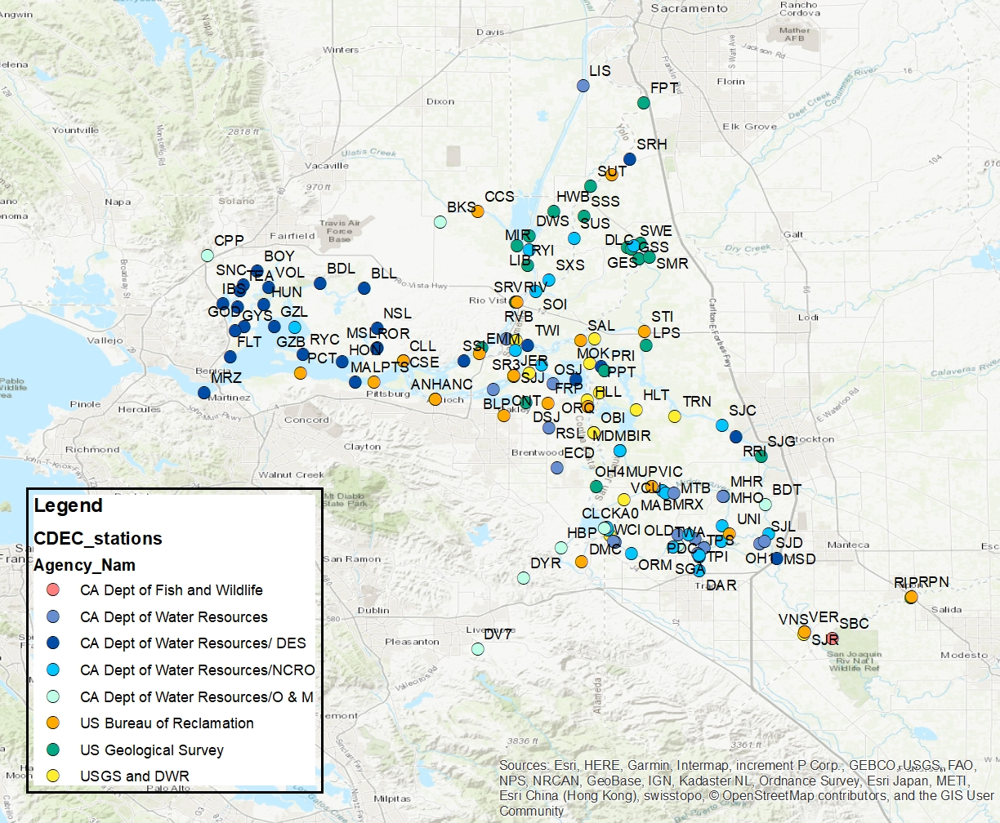

```{r setup, include=FALSE}
knitr::opts_chunk$set(echo = TRUE)
library(lubridate)
library(tidyverse)
library(vegan)
library(sf)
library(RColorBrewer)
library(gridExtra)
library(scales)
library(ggmap)
temps = readRDS("Temp_filtered (1).rds")
```

## Cluster analysis

So, Larry was unceratain as to how to do cluster analysis when we "just have one variable". While it's true that we only have temperature to work with, if we really only just had one variable we could group stations with similar average temperatures and be done with it. However, we really do have a multivariate dataset because each station has different average temperatures at different times of year, and different variance in tempareture. We want to group stations with similar temperature regimes, rather than just similar averages.

Now, there are a number of different ways to describe the temperature regime, but I thought I would start by taking the average daily mean temperature over the past five years.

I used Cat's continuous data set rather than the descrete data set because it is a more balanced design where we will have a mean temperature for each day of the year and we know it was taken at the exact same spot.


First clean up the data and make sure we only have complete years.

```{r}
temps2 = mutate(temps, Year = year(Datetime)) %>%
  group_by(Year, Station) %>%
  summarize(numb = length(Temp)) %>%
  filter(numb >7000, Year >= 2015) 

temps3 = group_by(temps2, Station) %>%
  filter(length(unique(Year)) >=4) %>%
  ungroup()

tempssub = merge(temps, temps3)


```


```{r warning=FALSE, message=FALSE, fig.width= 12}

#first calculate the daily means
tempmean = tempssub %>%
  filter(Date > as.Date("2014-1-1"), Station != "RYF") %>%
  mutate(julian = yday(Date)) %>%
  group_by(Station, julian) %>%
  summarize(Temp = mean(Temp, na.rm = T))

#put it into wide format for the cluster analysis
tempwide = pivot_wider(tempmean, id_cols = c(Station), 
                       names_from = julian, values_from = Temp)

row.names(tempwide) = tempwide$Station

#calculate distance and cluster
tempdist = dist(tempwide, "euclidean")
tempfit = hclust(tempdist, method = "ward.D")
plot(tempfit, main = "Clusters based on daily ave temp", cex = 0.6)

```

## Or we could use monthly means, mins, and maxes

I haven't sat down to compare the monthly mins, means, and maxes with the daily means, but a quick look seems like they are pretty similar

```{r warning=FALSE, message=FALSE, fig.width=12}


#monthly mean, min, and max per year
tempmo = temps %>%
  filter(Date > as.Date("2014-1-1"), Station != "RYF") %>%
  mutate(Month = month(Date), Year = year(Date)) %>%
  group_by(Station, Month, Year) %>%
  summarize(Temp = mean(Temp, na.rm = T), min = min(Temp), max = max(Temp))

#average over five years
tempmo2 = tempmo %>%
  group_by(Station, Month) %>%
  summarize(Temp = mean(Temp, na.rm = T), min = mean(min, na.rm = T), max = mean(max, na.rm = T))

#put it into wide format for the cluster analysis
tempmowide = pivot_wider(tempmo2, id_cols = c(Station), 
                       names_from = Month, values_from = Temp)
tempmowide2 = pivot_wider(tempmo2, id_cols = c(Station), 
                         names_from = Month, values_from = min)
tempmowide3 = pivot_wider(tempmo2, id_cols = c(Station), 
                         names_from = Month, values_from = max)

tempmowide4 = cbind(tempmowide, tempmowide2[,-1], tempmowide3[,-1])

row.names(tempmowide4) = tempmowide4$Station

#calculate distance and cluster
tempdist3 = dist(tempmowide4, "euclidean")
tempfit3 = hclust(tempdist3, method = "ward.D")
plot(tempfit3, main = "Clusters based on monthly ave, min max", cex = 0.6)

```

I thought I'd look at a quick NMDS too, just for fun

```{r warning=FALSE, message=FALSE, echo=FALSE}
tempNMDS = metaMDS(tempdist3, trymax = 200)
plot(tempNMDS, type = "n")
text(tempNMDS, "sites", labels = tempmowide4$Station)

```


## CDEC stations

Now the question is whether teh clusters actually work out geographically. I'm going to have to spend some time with this map printed out and a highlighter to see how it lines up.



## Cutting down the trees

Now I can cut my trees into groups to see how they map out.

```{r}
cutday = as.data.frame(cutree(tempfit, k = c(2,4,6,12)))
cutday$Station = row.names(cutday)
```


## Plot

I trimmed the tree into different numbers of groups, so see what we get when we try to divide it into 4,6, or 12 regions. Personally, I like the 6 group version best.

```{r}


#read in shapefile of the delta
delta = read_sf("DeltaShapefile/hydro_delta_marsh.shp")


#read in shapefile of EDSM regions
edsm = read_sf("EDSM_Subregions/EDSM_Subregions_03302020.shp")
edsm2 = read_sf("03302020_shape/EDSM_Subregions_03302020.shp")
#reference system is UTMs
st_crs(edsm) = 32610
st_crs(edsm2) = 32610
edsm = st_transform(edsm, 4326)

#for some reason they didn't include the strata in teh shapfile, so I"m attaching it seperately
EDSM = read.csv("C:/Users/rhartman/OneDrive - California Department of Water Resources/salinity control gates/SMSCG/EDSM_KDTR.csv")


foo1 =  sort(unique(EDSM$SubRegion))
foo2 = sort(unique(edsm$SubRegion))

foo3 = list(shapefile = foo2, EDI = foo1)


EDSM = mutate(EDSM, Date = mdy(Date)) %>%
  filter(year(Date) > 2018) %>%
  group_by( Region, SubRegion, Stratum) %>%
  summarize(count = length(Tow))

edsm = left_join(edsm, EDSM)

foo = select(as.data.frame(edsm), -geometry, -count)

#add lat/longs for the stations
stas = read.csv("StationLatLongs.csv")

cutday = merge(stas, cutday, all.x =T)
names(cutday) = c("Station", "Latitude", "Longitude", "grps2", "grps4", "grps6", "grps12")

#turn it into a spatial object
stashap = st_as_sf(cutday,
                coords = c("Longitude", "Latitude"),
                crs = 4326)

save(stashap, file ="stations.rdata")

#Make plots of the stations divided into four groups, six groups
#or twelve groups based on teh cluster analysis. 
gp4 = ggplot() +
  geom_sf(data = delta, alpha = 0.5)+
  geom_sf(data = stashap, mapping =aes(color = as.factor(grps4)))+
  theme_bw() + guides(color = FALSE) + 
  coord_sf(xlim = c(-122.2, -121), ylim = c(37.6, 38.8))+
  ggtitle("4 groups")

library(RColorBrewer)
mypal = c(brewer.pal(9, "Blues"), brewer.pal(9, "BuGn"), 
          brewer.pal(9, "Greys"), brewer.pal(9, "PuBu"), brewer.pal(9, "YlGn"))
gp6 = ggplot() +
  geom_sf(data = edsm, mapping = aes(fill = Region, color = Region), alpha = 0.5)+
  scale_fill_brewer(palette = "Set3")+
  geom_sf(data = delta, alpha = 0.5)+
  geom_sf(data = stashap, mapping =aes(color = as.factor(grps6)))+
<<<<<<< HEAD
=======
 # geom_sf_label(aes(label = Station), stashap) +
>>>>>>> 64f6a845d7d255d923f176fd15a56ed026a57b77
  scale_color_brewer(palette = "Set1")+
  theme_bw() + guides(color = FALSE, fill = FALSE) + 
  coord_sf(xlim = c(-122.2, -121), ylim = c(37.6, 38.8))+
  ggtitle("6 groups")

gp6

<<<<<<< HEAD
gp6a = ggplot() +
  geom_sf(data = edsm, mapping = aes(fill = Region), alpha = 0.5)+
  geom_sf(data = delta, alpha = 0.5)+
  geom_sf(data = stashap, mapping =aes(color = as.factor(grps6)))+
  theme_bw() + guides(color = FALSE, fill = FALSE) + 
  #coord_sf(xlim = c(-122.2, -121), ylim = c(37.6, 38.8))+
  ggtitle("6 groups")

gp6a
=======
>>>>>>> 64f6a845d7d255d923f176fd15a56ed026a57b77

gp12 = ggplot() +
  geom_sf(data = delta, alpha = 0.5)+
  geom_sf(data = stashap, mapping =aes(color = as.factor(grps12)))+
  theme_bw() + guides(color = FALSE) + 
  coord_sf(xlim = c(-122.2, -121), ylim = c(37.6, 38.8))+
  ggtitle("12 groups")

library(gridExtra)

foo = grid.arrange(gp4, gp6, gp12, nrow = 1, ncol = 3)

#ggsave("tempclusters.png",foo, device = "png", width = 12)

```
## Join with EDSM regions
<<<<<<< HEAD

I want to see how closely the EDSM regions map to my clusters. 

```{r}

spas = st_join(stashap, edsm)
stjoin = as.data.frame(spas)[,1:8]
=======

I want to see how closely the EDSM regions map to my clusters. Brian made one version of the shapefile that he tweaked a bit to cover more of the region. THen there is the EDSM subregions, teh EDSM regions, and the EDSM strata. Do any of them match our clusters? I'm using the 6-cluster grouping throughout.

```{r}


#read in shapefile of EDSM regions
edsm = read_sf("EDSM_Subregions/EDSM_Subregions_03302020.shp")
edsm2 = read_sf("EDSM_Subregions/Strata_1Dec2018_31Mar2019/Strata_1Dec2018_31Mar2019.shp")
edsm3 = read_sf("EDSM_Subregions/Subregions Phase 1/Subregions_1Dec2018_present.shp")
#reference system is UTMs
st_crs(edsm) = 32610
st_crs(edsm2) = 32610
st_crs(edsm3) = 32610
edsm = st_transform(edsm, 4326)
edsm2 = st_transform(edsm2, 4326)
edsm3 = st_transform(edsm3, 4326)

#perform a spatial join between the stations and Sam's subregions
spas = st_join(stashap, edsm)
spas2 = st_join(stashap, edsm2)
spas3 = st_join(stashap, edsm3)

stjoin = as.data.frame(spas)[,1:8]
stjoin2 = as.data.frame(spas2)[,1:8]
stjoin3 = as.data.frame(spas3)[,1:8]
stjoin = rename(stjoin, SamsSubregion = SubRegion, SamsRegion = Region)
stjoin3 = rename(stjoin3, EDSMSubregion = SubRegion, EDSMRegion = Region)

#put them all together into one master data frame for later use.
allstas = left_join(stjoin, stjoin2) %>%
  left_join(stjoin3) %>%
  rename(cluster = grps6) %>%
  dplyr::select(-geometry, -grps2, -grps4, -grps12, -SQM)

#See how many stations are in each subregion.
#regions = pivot_wider(stjoin, id_cols = c(Region, SubRegion), names_from = grps6, values_from = Station, values_fn = length)

#set up a palette for graphing all the subregions
mypal = c(brewer.pal(9, "Blues"), brewer.pal(9, "BuGn"), 
          brewer.pal(9, "Greys"), brewer.pal(9, "PuBu"), 
          brewer.pal(9, "YlGn"), brewer.pal(9, "BuPu"))

#plot of Sam's regions
gp6 = ggplot() +
  geom_sf(data = edsm, mapping = aes(fill = Region, color = Region), alpha = 0.5)+
  scale_fill_brewer(palette = "Set3")+
  geom_sf(data = delta, alpha = 0.5)+
  geom_sf(data = stashap, mapping =aes(color = as.factor(grps6)))+
  scale_color_brewer(palette = "Set1")+
  theme_bw() + guides(color = FALSE, fill = FALSE) + 
  coord_sf(xlim = c(-122.2, -121), ylim = c(37.6, 38.8))+
  ggtitle("Sam's Regions, 6 clusgters")

gp6

#plot of Sam's subregions
gp6x = ggplot() +
  geom_sf(data = edsm, mapping = aes(fill = SubRegion), alpha = 0.5)+
  scale_fill_manual(values = mypal)+
  geom_sf(data = delta, alpha = 0.5)+
  geom_sf(data = stashap, mapping =aes(color = as.factor(grps6)))+
  theme_bw() + guides(color = FALSE, fill = FALSE) + 
  coord_sf(xlim = c(-122.2, -121), ylim = c(37.6, 38.8))+
  ggtitle("Sam's SubRegions, 6 clusgters")

gp6x

#Plot of EDSM's strata 
gp6a = ggplot() +
  geom_sf(data = edsm2, mapping = aes(fill = Stratum), alpha = 0.5)+
  geom_sf(data = delta, alpha = 0.5)+
  geom_sf(data = stashap, mapping =aes(color = as.factor(grps6)))+
  theme_bw() + guides(color = FALSE, fill = FALSE) + 
  coord_sf(xlim = c(-122.2, -121), ylim = c(37.6, 38.8))+
  ggtitle("EDSM strata, 6 clusters")

gp6a

#plot of ESM's subregions
gp6b = ggplot() +
  geom_sf(data = edsm3, mapping = aes(fill = SubRegion), alpha = 0.5)+
  geom_sf(data = delta, alpha = 0.5)+
  geom_sf(data = stashap, mapping =aes(color = as.factor(grps6)))+
  theme_bw() + guides(color = FALSE, fill = FALSE) + 
  coord_sf(xlim = c(-122.2, -121), ylim = c(37.6, 38.8))+
  ggtitle("EDSM Subregions, 6 clusters")

gp6b

grid.arrange(gp6, gp6x, gp6a, gp6b, nrow = 1, ncol = 4)


```
OK, Now let's figure out what regions ALL the points are in (even the ones that don't have a complete data set from the past five years.. 

I used a Leaflet app to draw polygons aroudn the regions.


```{r}
# read in the new region shapefile

RosieReg = read_sf("RosieRegions/shpExport.shp")

#The shiny app didn't actually allow me to add attributes, so I'll do it now
RosieReg$notes = c("Suisun Marsh", "Suisun Bay", "Sac River", "North Delta", "Far North", "San Joaquin", "South")

#perform a spatial join between the stations and my regions
spasR = st_join(stashap, RosieReg)

write.csv(as.data.frame(spasR[,c(1,6,7)]), "Stations_wRosiesReg.csv")

stashap = mutate(stashap, cluster = grps6)
stashap$cluster[which(is.na(stashap$cluster))] = 7
stashap$cluster = factor(stashap$cluster, labels = c("1","2","3","4","5","6","NA"))

mypal2 = c(brewer.pal(6, "Dark2"), "grey")
#plot of my regions
gp6c = ggplot() +
  geom_sf(data = RosieReg, mapping = aes(fill = notes), alpha = 0.5)+
  geom_sf_label(aes(label = notes), RosieReg, nudge_y = .1, nudge_x = 0.1) +
  geom_sf(data = delta, alpha = 0.5)+
  geom_sf(data = stashap, mapping =aes(color = cluster))+
  scale_fill_brewer(palette = "Pastel2", guide = NULL) + 
  scale_color_manual(values = mypal2)+
  theme_bw() + 
  coord_sf(xlim = c(-122.2, -121), ylim = c(37.6, 38.8))+
  ggtitle("Rosie's Regions, 6 clusters")

gp6c
>>>>>>> 64f6a845d7d255d923f176fd15a56ed026a57b77

regions = pivot_wider(stjoin, id_cols = c(Region, SubRegion), names_from = grps6, values_from = Station, values_fn = length)

```

Can I see how far apart the clusters are?
```{r}

tempmean2 = merge(tempmean, cutday[,c(1,6)])

#put it into wide format for the cluster analysis
tempwide2 = pivot_wider(tempmean2, id_cols = c(Station, grps6), 
                       names_from = julian, values_from = Temp)

row.names(tempwide2) = tempwide2$Station

library(dendextend)
#calculate distance and cluster
tempdist = dist(tempwide2[,c(-1,-2)], "euclidean")
tempfit = hclust(tempdist, method = "ward.D")
plot(tempfit, main = "Clusters based on daily ave temp", cex = 0.6)


d <- as.dendrogram(tempfit)

mypal3 = mypal2[c(4,2,3,1,5,6)]

d <- d %>% color_branches(k=6, col = mypal3) %>%  color_labels(k=6, col = mypal3)

plot(d)
```
